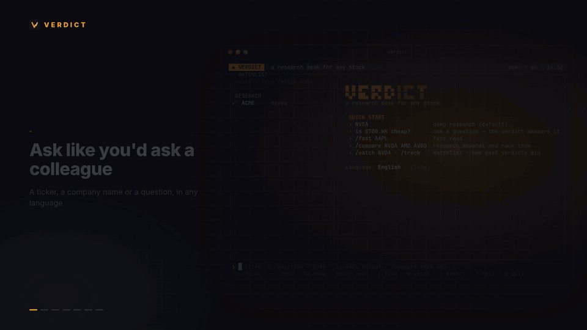

<p align="center"></p>

<h1 align="center">Verdict</h1>

<p align="center">
  <b>어떤 종목이든 쓸 수 있는 리서치 데스크 — 터미널, Claude Code, Codex에서.</b><br>
  몇 초 만에 실시간 데이터 · 애널리스트 4명 병렬 조사 · 강세 대 약세 토론 · 가격 조건이 담긴 분명한 결론.
</p>

<p align="center"><a href="README.md">English</a> · <a href="README.zh-CN.md">简体中文</a> · <a href="README.ja.md">日本語</a></p>

<p align="center">
  <a href="https://github.com/Zhao73/verdict/actions/workflows/ci.yml"></a>
  <a href="https://github.com/Zhao73/verdict/releases"></a>
  
  
  
  <a href="LICENSE"></a>
</p>

<p align="center">
  <a href="assets/verdict-demo.mp4"></a>
</p>
<p align="center"><sub>▶ 제품 영상: <a href="assets/verdict-motion.mp4">English</a> · <a href="assets/verdict-motion.zh-CN.mp4">中文</a> · 실제 데모: <a href="assets/verdict-demo.mp4">English</a></sub></p>

## 무엇을 얻나요

`verdict 삼성전자 지금 사도 돼?`, `verdict 005930 실적 발표 전에 들고 있어도 돼?`처럼 물어보면 약 3분 뒤 다음을 받습니다.

- **결론**: 매수 · 비중확대 · 보유 · 비중축소 · 매도, 확신도, 그리고 질문에 대한 직접적인 답
- **Verdict 점수(0–100)**: 가치·근거·펀더멘털·주가 흐름을 코드가 하나의 숫자로 묶어 등급을 교차 검증
- **가치 범위**: 약세 / 기본 / 강세 주당 가치와 현재가 대비 거리
- **확률이 붙은 가격 조건**: 피할 구간, 매수를 시작할 구간, 추가 매수 구간, 현재가의 위치, 그리고 3개월 안에 각 구간에 도달할 확률
- **강세와 약세 논거**, 촉매, 리스크, 포지션 계획, 그리고 판단이 틀렸음을 보여줄 조건
- **출처가 달린 근거**와 공유할 수 있는 HTML 리포트(가격 차트 포함)

한국 주식은 `005930.KS`, `005930`, `KRX:005930`, "삼성전자" 모두 됩니다. 데스크는 DART 전자공시와 한국어 뉴스를 읽고, 결론은 한국어로 작성됩니다.

## Verdict 고유 방법론

모델은 조사·토론·결정을 맡고, **계산은 코드가 합니다**. 7가지 방법이 모델이 쓰기 전에는 논점의 틀을 잡고, 결론이 나온 뒤에는 그 결론을 검증합니다.

- **주가에 반영된 성장**(역DCF): 현재 주가가 전제하는 향후 10년 성장률과 실제 성장률의 차이
- **옵션 내재 변동**: 옵션 시장이 반영한 ± 변동폭과, 그것이 최근 실제 변동보다 큰지 여부
- **시장 국면**: 추세 × 변동성 국면과 타이밍에 대한 시사점
- **도달 확률**: 3개월 안에 각 가격 구간에 도달할 확률
- **손익 구조**: 시나리오 가중 가치, 상승·하락 여지, 보상/위험
- **근거 균형**: 각 데스크의 발견을 출처 품질(공시 > 주요 언론 > 헤드라인)로 가중
- **일관성 점검**: 등급이 근거·가치·손익과 반대 방향이면 ⚠ 표시

이 결과는 **Verdict 점수**로 모입니다. 점수가 등급을 바꾸지는 않습니다. 공식과 기준값은 [docs/METHODS.md](docs/METHODS.md)(영어)에 있습니다. `verdict methods 005930`으로 앞의 3가지를 모델 없이 볼 수 있습니다.

<p align="center"></p>

## 언어 선택

기본적으로 질문한 언어로 답합니다. 언어를 고정하려면 한 번만 고르면 됩니다. 터미널에서는 `verdict lang`(번호 목록) 또는 `verdict lang ko`, 앱에서는 `/lang`을 씁니다. 선택은 저장되고, `verdict lang auto`로 자동 모드로 돌아갑니다. 한 번만 바꾸려면 `--lang`을 쓰세요.

## 설치

```bash
npm install -g github:Zhao73/verdict
verdict doctor     # Node, 엔진, 데이터 소스 점검
verdict demo       # 키 없이 오프라인으로 가상 기업 체험
verdict            # 전체 화면 앱
```

엔진은 `ANTHROPIC_API_KEY`(가장 빠름) 또는 로그인된 Claude Code 중 하나를 자동으로 사용합니다.

### Windows

Windows 10 / 11에서 바로 실행됩니다(WSL 불필요).

```powershell
winget install OpenJS.NodeJS.LTS
npm install -g github:Zhao73/verdict
verdict doctor
```

전체 화면 앱은 **Windows Terminal**에서 쓰는 것을 권장합니다. Claude Code는 `claude.exe`(공식 설치 프로그램)든 `claude.cmd`(npm)든 자동으로 찾습니다.

## Claude Code / Codex

```text
/plugin marketplace add Zhao73/verdict
/plugin install verdict@verdict
```

`/verdict 삼성전자`처럼 쓰면 됩니다. Codex에서는 `codex plugin marketplace add Zhao73/verdict` 후 `@verdict 삼성전자 분석해줘`.

지원 언어는 11개(한국어·영어·중국어 간체/번체·일본어·프랑스어·독일어·스페인어·이탈리아어·포르투갈어·네덜란드어), 지원 시장은 미국·한국·일본·중국·홍콩·대만·영국·유럽·호주 등입니다. 자세한 내용은 [English README](README.md#languages--markets)를 참고하세요.

<p align="center"><b>도움이 됐다면 ⭐ 하나가 다른 사람들이 찾는 데 큰 힘이 됩니다.</b></p>

<sub>공개 자료를 바탕으로 AI가 생성한 리서치입니다. 투자 조언이 아니며 틀릴 수 있습니다. MIT 라이선스.</sub>
