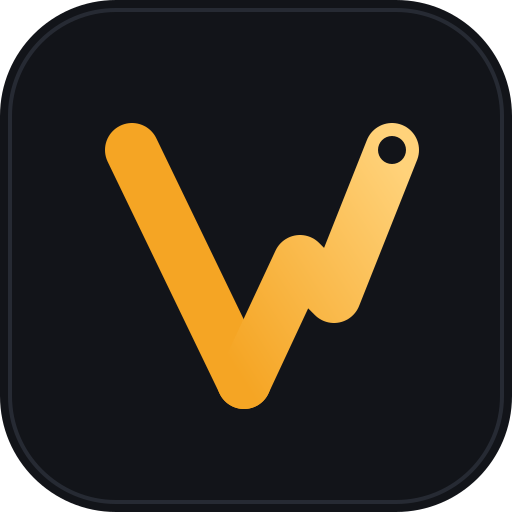
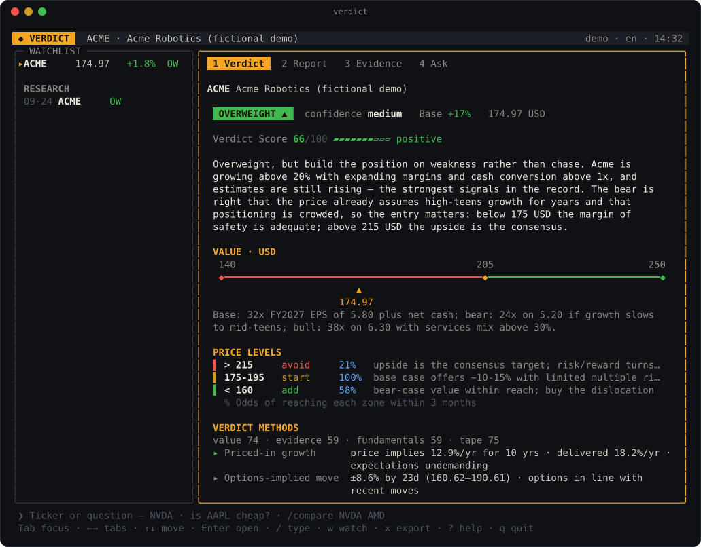
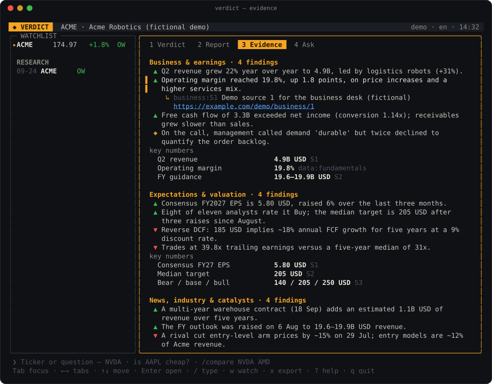
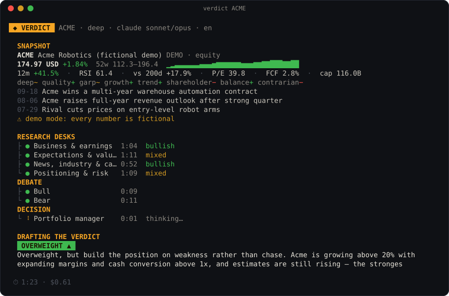
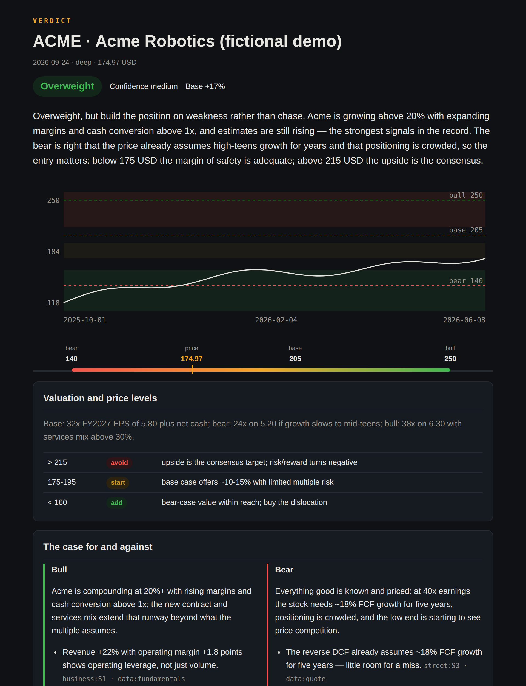

<p align="center">
  
</p>

<h1 align="center">Verdict</h1>

<p align="center">
  <b>A research desk for any stock — in your terminal, Claude Code and Codex.</b><br>
  Live data in seconds · four analysts in parallel · bull vs bear · one clear verdict with price levels.
</p>

<p align="center">
  <a href="#install">Install</a> ·
  <a href="#try-it-in-10-seconds">Demo</a> ·
  <a href="#the-app">The app</a> ·
  <a href="#claude-code--codex">Claude Code &amp; Codex</a> ·
  <a href="README.zh-CN.md">简体中文</a> ·
  <a href="README.ja.md">日本語</a> ·
  <a href="README.ko.md">한국어</a>
</p>

<p align="center">
  
</p>

## What you get

Ask about a stock the way you would ask a colleague — `verdict NVDA`, `verdict "is 0700.HK cheap?"`,
`verdict AMD 财报前值得拿着吗` — and about three minutes later you have:

- **A verdict:** Buy · Overweight · Hold · Underweight · Sell, with confidence and a direct answer to your question.
- **A value range:** bear / base / bull per share, how it was derived, and how far the price is from base.
- **Price levels:** where to avoid, where to start, where to add — and which zone the price is in now.
- **Both sides argued:** the strongest bull case and bear case, and who won.
- **What to watch:** dated catalysts, ranked risks, a position plan and what would prove it wrong.
- **Receipts:** every finding is tied to a source you can open; missing data is listed, never guessed.
- **A report you can share:** Markdown and a self-contained HTML page with a price chart.

## How it works

```
 snapshot ─▶ 4 research desks ─▶ bull ┐
 (code, 2s)   in parallel            ├─▶ portfolio manager ─▶ verdict + report
              business · street      │    (streams as it writes)
              news · risk       bear ┘
```

1. **Snapshot** — code fetches price, history, SEC fundamentals and multiples, filings, options,
   dated news and eight deterministic method screens in parallel, before any model runs.
2. **Desks** — four analysts research in parallel from that snapshot (≈5 targeted searches each).
   Your question steers them: earnings, valuation, a short-term trade, long-term holding or risk.
3. **Debate** — a bull and a bear argue from the record, in parallel.
4. **Decision** — a portfolio manager weighs it all; you watch the conclusion being written.
5. **Report** — assembled by code from the saved results, so nothing gets lost in a summary.

`--fast` runs one research pass and the decision (about a minute).

## Languages & markets

Ask in your language, about any market. Verdict answers in the language you type in (or `--lang`),
and the interface, report and HTML page follow it.

| Languages | English · 简体中文 · 繁體中文 · 日本語 · 한국어 · Français · Deutsch · Español · Italiano · Português · Nederlands — other codes work too; models write in them and labels fall back to English |
|---|---|

| Market | Write it as | Filings the desks read | Local news |
|---|---|---|---|
| 🇺🇸 US | `NVDA` · `BRK-B` | SEC EDGAR (+ XBRL fundamentals in the snapshot) | Google News US |
| 🇨🇳 China A-shares | `600519` · `SH600519` · 贵州茅台 | CNINFO 巨潮资讯 | 简体中文 |
| 🇭🇰 Hong Kong | `0700.HK` · `0700` · 腾讯 / 騰訊 | HKEXnews 披露易 | 繁體中文 |
| 🇹🇼 Taiwan | `2330.TW` · 台積電 | MOPS 公開資訊觀測站 | 繁體中文 |
| 🇯🇵 Japan | `7203.T` · `7203` · `TYO:7203` · トヨタ | EDINET / TDnet | 日本語 |
| 🇰🇷 Korea | `005930.KS` · `KRX:005930` · 삼성전자 | DART 전자공시 | 한국어 |
| 🇬🇧 UK | `SHEL.L` · `LON:SHEL` | RNS / Companies House (pence converted to £) | en-GB |
| 🇪🇺 Europe | `MC.PA` · `SAP.DE` · `ASML.AS` · `SAN.MC` · `ENI.MI` · `NESN.SW` · `NOVO-B.CO` … | national regulators / company IR | local edition |
| 🇦🇺 Australia · NZ | `BHP.AX` · `ASX:BHP` · Commonwealth Bank | ASX / NZX announcements | en-AU · en-NZ |
| 🇨🇦 🇮🇳 🇸🇬 🇧🇷 🇲🇽 | `SHOP.TO` · `RELIANCE.NS` · `D05.SI` · `PETR4.SA` | SEDAR+ · NSE/BSE · SGXNet · CVM | local edition |

Company names are understood in their home languages (腾讯, 台積電, トヨタ, 삼성전자, LVMH,
Commonwealth Bank …). When a name also trades in the US, Verdict picks the home listing if your
language or locale is from that market (a German asking about SAP gets `SAP.DE`; an Australian
locale gets `BHP.AX`), otherwise the US line. The keyless snapshot has full SEC fundamentals for
US listings; for other markets it has price, history, technicals and local news, and the desks read
the local filings listed above.

## Install

```bash
npm install -g github:Zhao73/verdict
verdict doctor            # checks Node, your engine and the data sources
```

Verdict needs Node 20+ and one engine:

| Engine | Use it when | |
|---|---|---|
| **api** | `ANTHROPIC_API_KEY` is set | Fastest. Official Anthropic SDK with streaming and server-side web search. |
| **claude** | Claude Code is installed and signed in | Uses your Claude Code plan; each step is a headless `claude -p` call. |

It picks one automatically; `--engine api|claude` overrides.

## Try it in 10 seconds

No key, no network — a full run on a fictional company:

```bash
verdict demo           # stream mode
verdict demo --app     # the full-screen app
```

## The app

Run `verdict` with no arguments.

<p align="center"></p>

- **Command bar** — type a ticker or a question; `/fast`, `/compare NVDA AMD AVGO`, `/watch`,
  `/track`, `/export`, `/lang zh-CN`, `/help`.
- **Sidebar** — your watchlist (price, day move, last verdict) and research history.
- **Tabs** — *Verdict* card · full *Report* · *Evidence* (select a finding, Enter shows its sources)
  · *Ask* follow-up questions answered from the report.
- Keys: `Tab` focus · `← →` or `1-4` tabs · `↑ ↓ PgUp PgDn` or the mouse wheel to scroll · `w` watch ·
  `x` export HTML · `?` help · `q` quit. Research keeps running while you browse.

## One-shot commands

<p align="center"></p>

```bash
verdict NVDA                          # deep research, live progress, then the verdict card
verdict AAPL "is it cheap?"           # the verdict answers your question
verdict 7203.T --fast --lang ja       # fast read, in Japanese
verdict compare NVDA AMD AVGO         # research each and rank them
verdict watch add NVDA AAPL           # watchlist with alerts: price entered a zone, new filing, stale verdict
verdict track                         # how past verdicts did since
verdict ask NVDA "what if rates rise?"
verdict history · verdict show NVDA · verdict export NVDA
verdict quote|snapshot|news|filings|options|lenses NVDA · verdict macro     # data only, no model calls
```

After a verdict you can keep asking questions right there. A verdict from the last six hours is
reused unless you add `--fresh`. `--json` prints the full result for scripts.

## Claude Code & Codex

**Claude Code**

```text
/plugin marketplace add Zhao73/verdict
/plugin install verdict@verdict
```

Then `/verdict NVDA`, `/verdict is AAPL a buy?` — or just ask "research NVDA". Four `desk`
subagents research in parallel, two `advocate` subagents argue, Claude decides; the bundled MCP
server supplies the snapshot, per-task instructions, validation and the report. To skip permission
prompts, allow `mcp__plugin_verdict_verdict__*`, `WebSearch` and `WebFetch` in `/permissions`.

**Codex**

```bash
codex plugin marketplace add Zhao73/verdict
codex plugin add verdict@verdict
```

Restart Codex and ask `@verdict research NVDA`.

Runs from every surface share `~/.verdict/`, so a verdict made in Claude Code shows up in the
terminal app, the watchlist and the track record.

## The HTML report

<p align="center"></p>

`x` in the app or `verdict export NVDA` saves it to the current folder. It is one file with no
scripts, in light and dark themes.

## Data

Keyless public sources, cached on disk: Yahoo Finance (delayed quotes, history, search), SEC
EDGAR (XBRL facts → TTM metrics and multiples, filings), Google News (dated headlines), Cboe
(delayed options) and FRED (macro). ETFs are researched through their holdings and indices through
their methodology — never as if they were a company. When a source is unreachable, the report names
the gap. Set `VERDICT_SEC_CONTACT=you@example.com` — the SEC asks for a contact.

## Configuration

| | |
|---|---|
| `--model`, `--research-model`, `--debate-model`, `--decision-model` | defaults: api `claude-sonnet-5` / `claude-opus-5`; claude `sonnet` / `opus` |
| `--lang` | report language; default is the language you type in |
| `VERDICT_HOME` | where runs, cache and the watchlist live (default `~/.verdict`) |
| `NO_COLOR` | plain output |

## Development

```bash
git clone https://github.com/Zhao73/verdict && cd verdict && npm install
npm test          # 56 tests, offline: fixtures, a scripted engine and a fake `claude`
npm run shots     # regenerate the README images from the real renderers
```

`src/engine` research engine (markets, names, data, pipeline) · `src/i18n` eleven locales · `src/models` api and claude engines · `src/tui` full-screen app ·
`src/cli` commands and stream mode · `src/render` Markdown / HTML / terminal · `src/mcp` plugin
server. The engine, MCP server and renderers have no dependencies, so the plugins run straight from
a checkout. See [CHANGELOG.md](CHANGELOG.md).

---

<sub>Verdict produces AI-generated research from public sources. It is not investment advice and
it can be wrong — check the sources before you act. Screenshots use a fictional company. MIT license.</sub>
