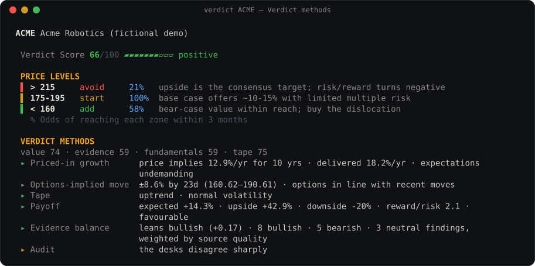

# Verdict methods

[简体中文](METHODS.zh-CN.md)

Verdict's models research, argue and decide. **Code does the arithmetic.** Seven methods run
deterministically on the facts: three before any model writes, so the desks can test a thesis
against them, and four after the decision, to audit it. Together they produce the **Verdict
Score**. Each method either returns a number or abstains with a reason. An abstention is a data
gap, never a vote.

<p align="center"></p>

| | Method | Question it answers | Cited as |
|---|---|---|---|
| before | Priced-in growth | What must go right for today's price to be fair? | `method:implied_growth` |
| before | Options-implied move | How far does the options market expect the price to move? | `method:implied_range` |
| before | Tape | Is the trend helping or fighting the thesis, and is it calm or stormy? | `method:regime` |
| after | Zone odds | How likely is the price to reach each price level at all? | |
| after | Payoff | What does the value range pay, weighted by scenario? | |
| after | Evidence balance | Which way does the weight of the sourced evidence lean? | |
| after | Audit | Do the rating, value, payoff and evidence agree? | |

## Before the models write

### 1. Priced-in growth (reverse DCF)

Most valuation debates ask what a company is worth. This method turns the question around and
asks what the price already assumes. The desks can then test that assumption against evidence.

1. Enterprise value = market value − net cash.
2. A two-stage discounted cash-flow model:
   - Trailing free cash flow (net income if free cash flow is negative) grows at *g* a year for
     10 years.
   - After that it grows 2.5% a year forever.
   - Everything is discounted at 9%.
3. Solve for the *g* that makes the model equal the enterprise value (bisection, from −50% to
   +100% a year).
4. Compare *g* with the company's own 3-year revenue growth. The **gap** is *g* minus that
   history:
   - more than +5 pp: *demanding*
   - less than −5 pp: *undemanding*
   - otherwise: *in line*

It abstains when:
- there are no reported financials (the keyless snapshot has SEC XBRL data for US listings),
- both cash flow and earnings are negative (the price rests on a future turn to profit), or
- net cash exceeds market value.

### 2. Options-implied move

- One-standard-deviation move = at-the-money implied volatility × √(days / 365).
- The range is price × e^(±move), for the nearest expiry and for the expiry nearest 30 days.
- Implied ÷ 30-day realized volatility shows whether options price more movement than the stock
  has recently delivered:
  - above 1.25: an event is priced in
  - below 0.8: complacent
  - otherwise: fair

### 3. Tape (market regime)

- **Trend:**
  - price above its 200-day average and the 50-day above the 200-day: *uptrend*
  - both below: *downtrend*
  - otherwise: *turning*
- **Volatility:** 30-day realized ÷ 90-day realized:
  - above 1.25: *stormy*
  - below 0.8: *calm*
  - otherwise: *normal*

The nine combinations each come with a timing note for the desks. For example, *disorderly
decline: capitulation risk and opportunity; stage entries*.

## After the decision

### 4. Zone odds

A price level the stock will not see in the holding period is not a plan. For every price zone,
Verdict computes the probability that the price trades into it within three months. It models
the price as a driftless lognormal walk and uses the reflection principle:

```
P(touch barrier B) = 2 · Φ( −|ln(B / S)| / (σ · √T) ),   T = 0.25 years
```

σ is the at-the-money implied volatility nearest 60 days, or realized volatility when there are
no options. A zone the price is already in reads 100%.

### 5. Payoff

The scenario-weighted value is 25% bear + 50% base + 25% bull. From it Verdict reports:
- the expected return,
- the upside to the bull value and the downside to the bear value,
- **reward-to-risk** = upside ÷ |downside|.

The payoff reads:
- *favourable*: expected return above +5% and reward-to-risk of 2 or more
- *unfavourable*: expected return below −5%, or reward-to-risk under 0.8
- *balanced*: otherwise

### 6. Evidence balance

Every sourced finding from every desk casts a vote: +1 bullish, −1 bearish, 0 neutral or mixed.
Each vote is weighted by the quality of its best source:

| Source | Weight |
|---|---|
| exchange and regulator filings, investor-relations pages, code-fetched data | 1.0 |
| Verdict methods and method lenses | 0.9 |
| major financial press (Reuters, Bloomberg, FT, WSJ, Nikkei, Caixin …) | 0.8 |
| headlines and other web pages | 0.6 |

A finding that cites two or more sources gets ×1.15.

**Balance** = Σ vote·weight ÷ Σ weight, from −1 to +1. It *leans bullish* above +0.15 and
*leans bearish* below −0.15. Verdict also computes a balance for each desk. When two desks differ
by 1 or more, the desks are *split*.

### 7. Audit

Code checks the decision for contradictions:
- the rating against the evidence balance,
- the rating against the base value (a Buy or Overweight above base, a Sell or Underweight below
  it),
- the rating against the payoff,
- high confidence despite three or more data gaps or a failed task,
- split desks.

The audit never changes the rating. It shows the reader where the verdict needs defending.

## The Verdict Score

| Component | Weight | 0–100 from |
|---|---|---|
| Value | 35% | payoff expected return: −30% → 0, +30% → 100 |
| Evidence | 30% | 50 + 50 × evidence balance |
| Fundamentals | 20% | average of the non-technical method lenses |
| Tape | 15% | uptrend 75 · turning 50 · downtrend 25; calm +5, stormy −10 |

Missing components are dropped and the remaining weights re-normalized. With fewer than two
components there is no score. Bands: 70+ strong · 55+ positive · 45+ neutral · 30+ weak · below
30 poor.

The score cross-checks the rating; it never replaces it. A Buy with a score of 40 is a claim the
report has to defend.

## Method lenses

Eight pass/fail screens also run on the snapshot, each cited as `lens:<id>`:
- deep value
- quality compounder
- growth at a reasonable price
- secular growth
- trend and momentum
- shareholder yield
- forensic balance-sheet risk
- contrarian reversal

A lens with too few checks that have data abstains as `out_of_scope`.

## Where they show up

- `verdict methods NVDA`: the three snapshot methods, with no model calls.
- The verdict card, the app's Verdict tab, the Markdown and HTML reports, and the plugin's
  `verdict_finish` summary.
- Each run saves them in `run.json` as `analytics`. Runs saved before 1.1 are analysed when
  opened.
- Code: [`src/engine/methods.mjs`](../src/engine/methods.mjs). Tests:
  [`test/methods.test.mjs`](../test/methods.test.mjs).

## Limits

- The reverse DCF uses a fixed 9% discount rate and 2.5% terminal growth. It is a lens on
  expectations, not a price target.
- The keyless snapshot has reported financials only for US listings. For other markets the desks
  read local filings, and Priced-in growth abstains.
- Zone odds ignore drift, jumps and earnings gaps. Treat them as rough odds, not a forecast.
- The evidence weights are heuristics. They are published here so you can disagree with them.
